  

  <a href="#about-me">About</a> ·
  <a href="#toolkit">Toolkit</a> ·
  <a href="#featured-projects">Projects</a> ·
  <a href="#github-activity">Activity</a> ·
  <a href="https://github.com/Sooraj45?tab=repositories">Explore my repositories ↗</a>

## About me

I’m **Sooraj Poojary**, a **DevOps & Cloud Enthusiast** focused on building and deploying applications, exploring cloud infrastructure, and learning how to make systems more reliable through automation.

**Currently exploring:** cloud infrastructure · Docker workflows · Python automation · networking & security.

## Toolkit

## Featured projects

| Project | Explore |
| :--- | :--- |
| **💊 Pharmacy frontend** | [JavaScript frontend repository →](https://github.com/Sooraj45/pharmacy_frontend) |
| **🔊 Text-to-speech IoT** | [Python project repository →](https://github.com/Sooraj45/text-to-speech-iot) |
| **💊 Pharmacy Management System** | [Pharmacy management fork →](https://github.com/Sooraj45/PharmacyManagementSystem) |

**More interests:** Docker projects, cloud infrastructure, and automating application deployments.

## GitHub activity

  
  

Activity cards are provided by external services and may be cached. The terminal animation is decorative.

---

<b>BUILD → DEPLOY → MONITOR → AUTOMATE → REPEAT</b>

Always learning. Always building. <a href="https://github.com/Sooraj45">Connect with me on GitHub ↗</a>

